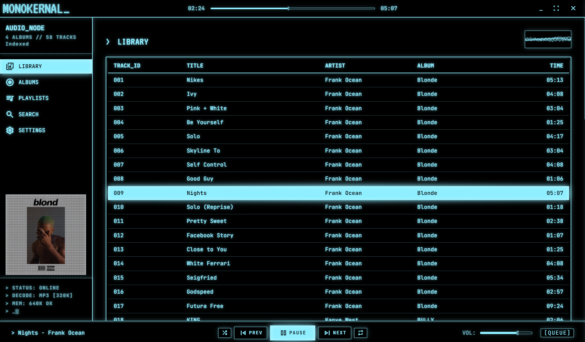
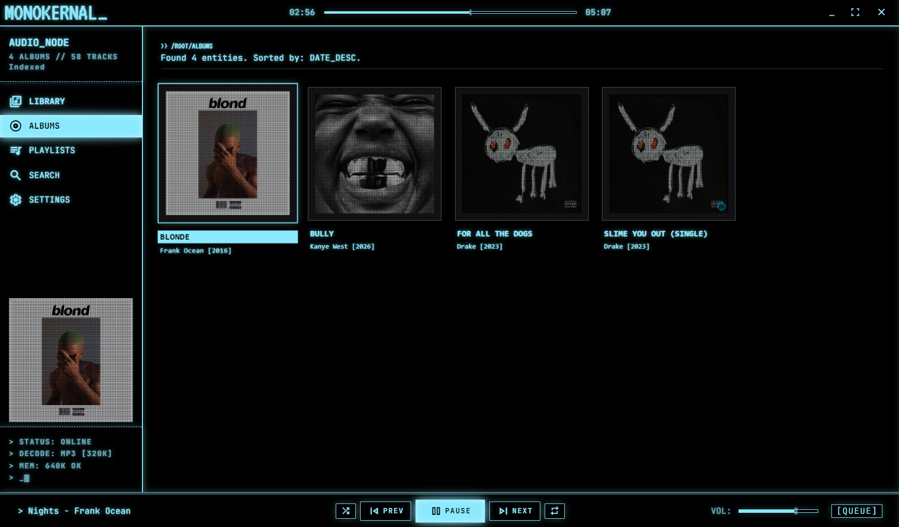
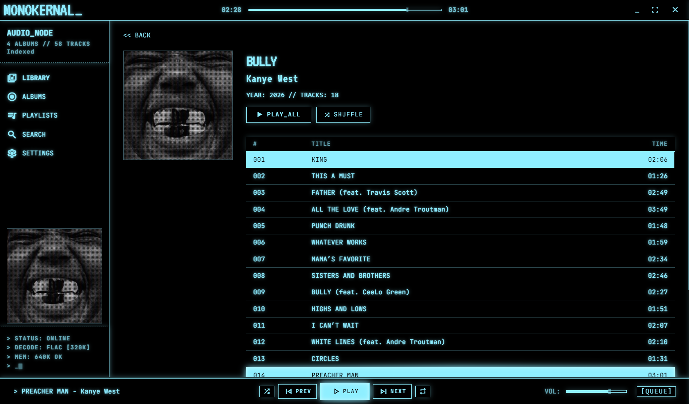
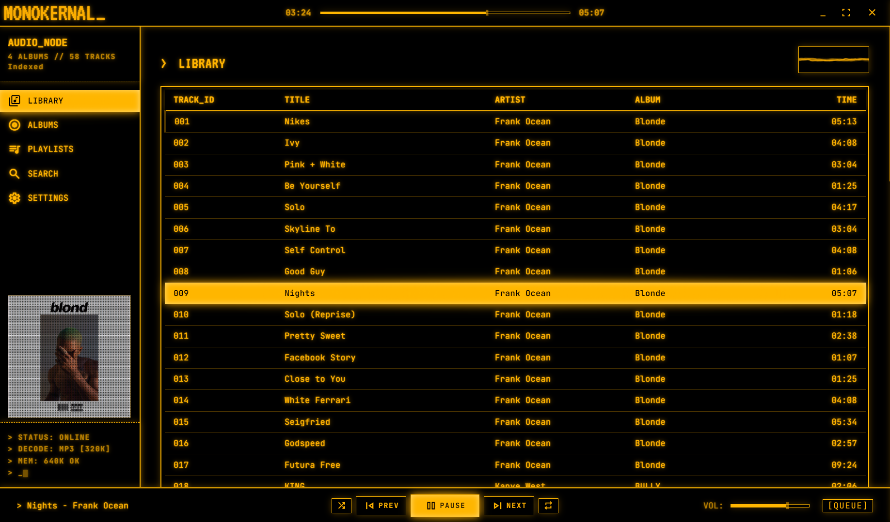
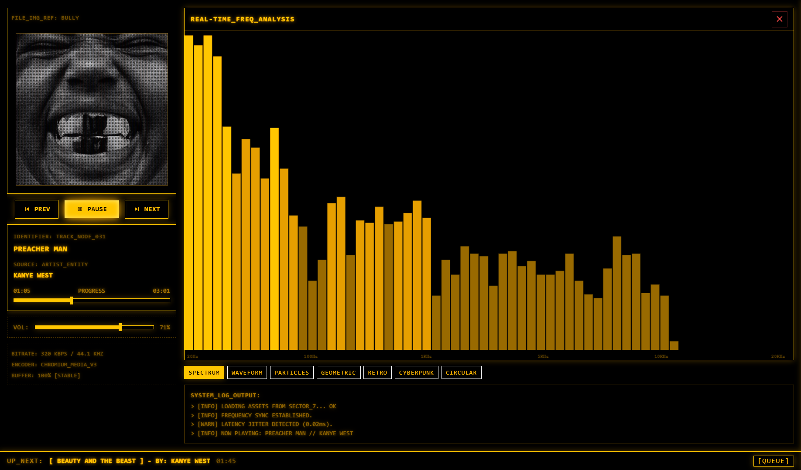
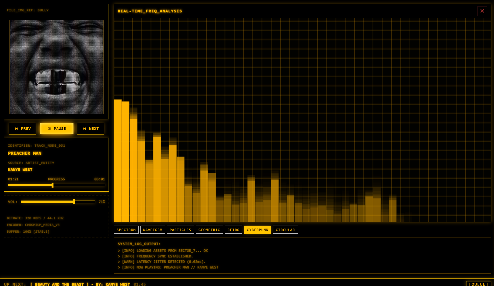
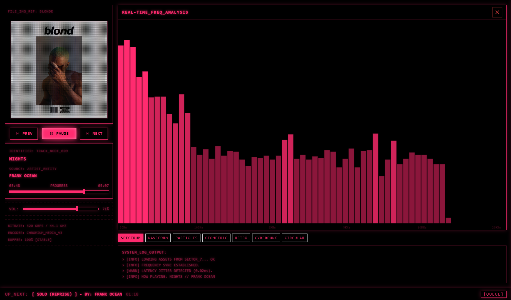
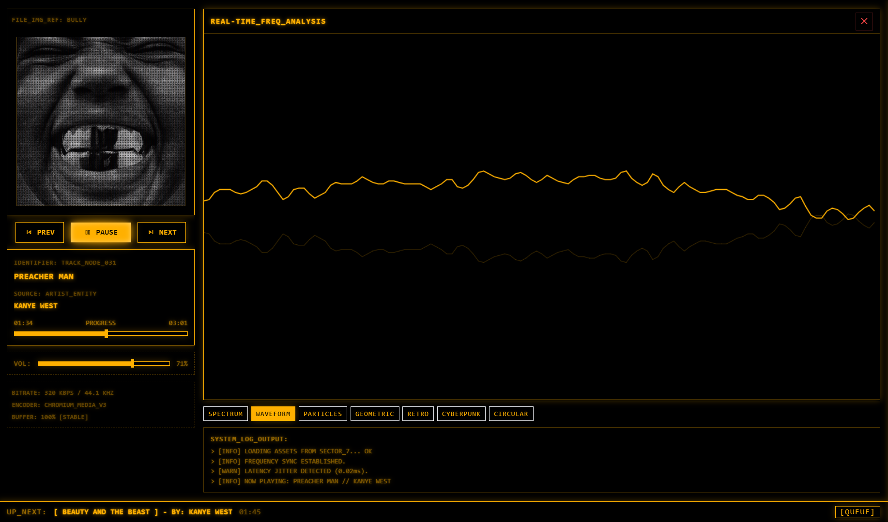
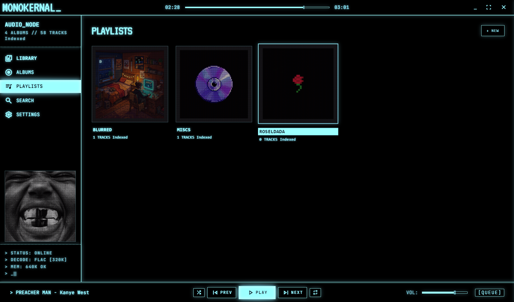

# monokernal-music-player
# Monokernal 🎧

> Retro terminal-style offline music player with CRT aesthetics and modern controls.

---

## ✨ Overview

**Monokernal** is a desktop music player built with a strong focus on minimalism, performance, and visual identity.
It combines a **terminal-inspired interface** with smooth playback and customizable visual themes.

Designed for users who prefer:

* offline music libraries
* distraction-free UI
* aesthetic-driven experiences

---

## 🚀 Features

* 🎵 Offline music playback
* 📂 Folder-based library system
* 🖥️ CRT terminal-inspired interface
* 📊 Real-time waveform visualizer
* 🎨 Multiple visual themes (Amber, Cyberpunk, Synthwave, Pink)
* ⚡ Fast and lightweight performance
* 🎛️ Playback controls (play, pause, next, previous, seek, volume)
* 📀 Album and playlist views

---

## 🖼️ Preview

### 🎧 Main Interface



### 📀 Album View



### 📀 Album Inside



### 🎛️ Amber Theme



### ▶️ Now Playing (Amber)



### 🌆 Cyberpunk Theme



### 🌸 Pink Theme



### 🌄 Synthwave Theme



### 📂 Playlist View



---

## 📥 Download

👉 Download the latest version from Releases:
https://github.com/MohitxSharmaa/monokernal-music-player/releases

---

## 🛠️ Tech Stack

* **Electron** – Desktop application framework
* **React** – UI development
* **Vite** – Fast build tooling
* **Node.js** – Runtime environment

---

## ⚙️ Run Locally

```bash
git clone https://github.com/MohitxSharmaa/monokernal-music-player.git
cd monokernal-music-player
npm install
npm run dev
```

---

## 📦 Build

```bash
npm run dist
```

---

## 👨‍💻 Developer

Mohit Sharma
📧 [mohitxwork99@gmail.com](mailto:mohitxwork99@gmail.com)

---

## 📜 License

MIT License

---

## ⭐ Support

If you like this project, consider giving it a ⭐ on GitHub.
